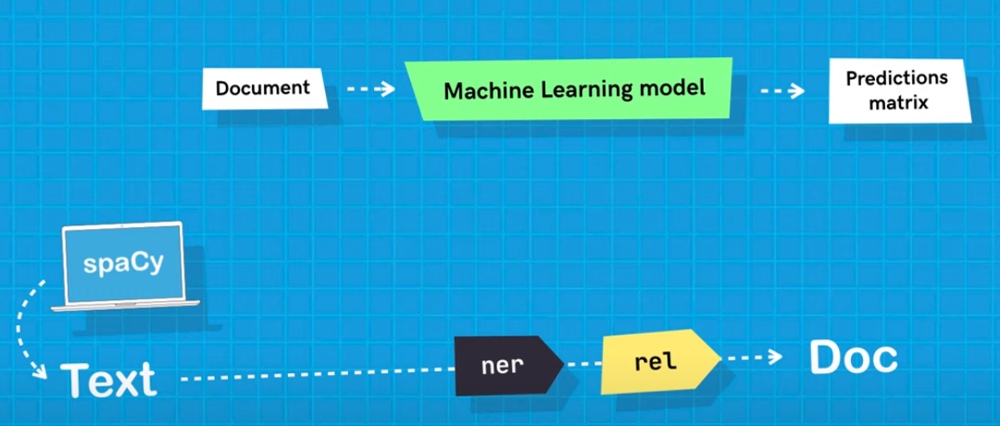

# Criadndo um modelo de Relation Extraction

O processo de `Relation Extraction (RE)` é, em geral, a tarefa desenvolvida posterior à extração de entidades nomeadas (NER), o qual irá classificar o tipo de relação entre as entidades nomeadas encontradas. Para isso, treina-se um modelo específico.



## Intro

Este projeto foi criado usando como template o projeto [rel_component](https://github.com/explosion/projects/tree/v3/tutorials/rel_component) que, por sua vez, está baseado no [tutorial](https://www.youtube.com/watch?v=8HL-Ap5_Axo) da explosion sobre `Relation Extraction` component.

```python
python -m spacy project clone tutorials/rel_component ./RE
```

Este tipo de componente (RE) demanda, necessariamente, a criação de um modelo (ou uma layer a ser usada numa rede neural). No caso do projeto usado como template e no tutorial, implementa-se o modelo usando o [thinc.ai](https://thinc.ai/). Contudo, o mesmo poderia ser implementado com modelos do [pytorch](https://pytorch.org/) ou [tensorflow](https://www.tensorflow.org/).

### Criando modelo RE

Usando o `thinc`, será implementada uma camada com *foward function* ([`instance_foward`](./RE/scripts/rel_model.py#L59)) e *backpropagation* ([implementado na mesma função do *foward function*](./RE/scripts/rel_model.py#L83)). Ao implementar com `thinc`, ganha-se em transparência e flexibilidade, segundo os autores do tutorial.

No *foward-function* ([`instance_forward`](./RE/scripts/rel_model.py#L59)) o texto será tokenizado e será processado até a sua redução em duas dimensões de vetores de entidade (tanto i->j como j->i). Dita função retorna uma matriz com um "tensor" para cada candidato por linha, assim como um callback de [`backpropagation`](./RE/scripts/rel_model.py#L83).

A implementação da função [`get_instance`](./RE/scripts/rel_model.py#L29) depende do caso de uso:
- Pode ser uma função que emparelha duas entidades em um texto (doc) desde que as entidades estejam a uma distância máxima (`max_length`) entre elas;
- Pode-se definir um conjunto de relações candidatas possíveis entre duas entidades que co-ocorrem na mesma frase. 

### Config.cfg

É no [`config.cfg`](./RE/configs/rel_tok2vec.cfg) que devemos declarar as variáveis e hiperparâmetros do modelo. As funções/modelos criados/declarados antes são indicadas para serem instancadas.

O primeiro ponto é o `NLP`. Dentre vários parâmetros de configuração, a `pipeline` é um ponto a ser considerado. No exemplo, não adicionaram o processo de NER antes do RE, por simplicidades, ou por estarem considerando um padrão básico de entidades. Mas deixam claro no vídeo a importância em adicionar o processo de NER à pipeline para cenários realistas.

Para cada `component`, uma `factory` (ou `source`) deverá ser informada para a criação da componente e a ela, um modelo será configurado com os parâmetros necessários nos seus respectivos blocos. A idéia é sempre evitar parâmetros escondidos para manter transparência e reprodutibilidade.

Em casos de `factory` customizadas, deve ser passada como [`@architectures` o modelo criado com `thinc`]((./RE/configs/rel_tok2vec.cfg#L41)) ou proveniente de outra framework. No caso do modelo criado, temos que especificar os parâmetros e sublayers ([`tok2vec`](./RE/configs/rel_tok2vec.cfg#L46), [`pooling`](./RE/configs/rel_tok2vec.cfg#L50)).

`custom factory>model arquitecture>sublayers`

A notação `@` é usada para acessar métodos de uma `registry` com um nome específico 

### Treinable component

Para criar um componente treinável [*treinable component*](https://spacy.io/usage/processing-pipelines#trainable-components), usa-se uma subclasse [`TreinablePipe`](./RE/scripts/rel_pipe.py#L38) que terá o modelo de machine learning definido no `config.cfg`.


A subclasse deve ter ao menos dois métodos: [`TrainablePipe.predict`](https://spacy.io/api/pipe#predict) and [`TrainablePipe.set_annotations`](https://spacy.io/api/pipe#set_annotations).

A inicialização do `component` deve ser feito logo após sua criação e antes do treinamento. Esse método é chamado pelo `nlp.initialize`, que confirma que componente e modelos internos estão devidamente configurados. O config tem um bloco chamado `initialize` para que sejam passadas as informações relavantes para este passo.

Uma vez criado e inicializado, o processo de treinamento do modelo é, então, iniciado (usando o método [`update`](./RE/scripts/rel_pipe.py#L106)) e a função anterior não será mais relevante. O método `update` recebe os dados de treinamento instanciados como [`Example`] object.

> `Exemple` é um objeto do spacy 3, e armazena tanto um docuemnto com as prediões como um documento chamado `reference` que possui as `annotations`.

Ainda sobre o método `update`: o mesmo irá primeiramente, criar as predições com o modelo atual para, então, compará-las com os dados de exemplo (`gold-standard`) para calcular a perda, ajustar o modelo pelo `backpropagation`.

Com o modelo treinado o `predict` model irá... produzir as predições, delegando ao modelo de aprendizado de máquina e retornando os escores preditos. Caso haja interesse em salvar os escores produzidos, é importante que a função `set_annotations` seja chamada em seguida. E é isso que faz o `__call__`

Para otimizar o processo de treinamento o `TrainablePipe` executa em `batches`.

O [`set_annotations`](./RE/scripts/rel_pipe.py#L93) recebe a matriz de scores das predições, as interpreta e modifica o objeto `Doc`, adicionando as anotações corretas. É o que acontece "por trás das cortinas", quando se instancia o `nlp` com um texto.


### Usando Transformer

Para saber como implementar um modelo já criadop, seja do `tensorflow`, `pytorch` ou quaqluer outro, veja a sequencia do [video](https://youtu.be/8HL-Ap5_Axo?t=2088).

## Executando o spaCy project

```python
python -m spacy project run all ./RE/
```
