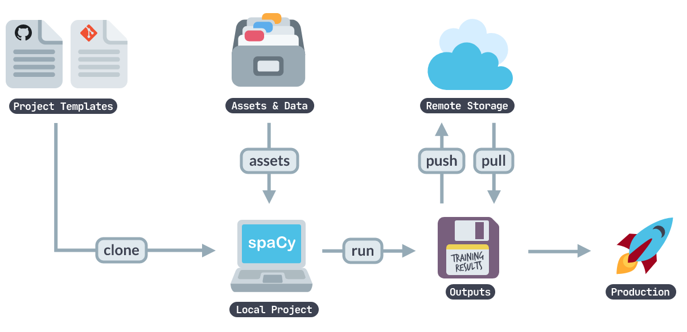

## [spaCy projects](https://spacy.io/usage/projects)

*spaCy projects* permite gestionar e compartilhar fluxos de trabalho "end-to-end" para diferentes casos e domínios, organizar treinamento, empacotamento e servindo *pipelines* customizados. Para começar, basta clonar um modelo de projeto prédefinido, o ajustando às necessidaders, carregando dados específicos, treinando *pipeline*, exportando-o como um módulo python, subindo os resultados a um servidor de armazenamento remoto e compartilhando com a equipe. 



1. Clone project template
O comando `spacy project clone` clona um modeo de projeto prexistente e copia os arquivos para um diretório local. Tendo isso, pode-se executar o projeto (por exemplo, treinar um *pipeline*).

`python -m spacy project clone pipelines/tagger_parser_ud`

Por padrão, o projeto será clonado no diretório de trabalho. Pode-se especificar um segudno argumento que define o diretorio ao qual o mesmo deverá ser clonado. O `--repo` permite definir um repositório a partir do qual o modelo será clonado, caso o modelo não seja do repositório do spaCy.

2. Fetch the project assets

*Assets* são arquivos que o projeto necessita. Por exemplo, os dados de treinamento e avaliação ou vetores prétreinados e *embeddings* para iniciar o modelo. 
Cada modelo de projeto possui um `project.yml` que especifica os ativos a serem baixados e onde organizá-los. 

```commandline
python -m spacy project assets
```

Os URLs dos ativos podem ser diferentes protocolos: HTTP, HTTPS, FTP, SSH, e até cloud storage such as GCS and S3.

É possível que o projeto inclua ativos muito grandes que não precisem ser baixados necessariamente ao fazer o clone do projeto. É por isso que os ativos podem ser marcados como "extra". Por padrão, esses ativos não são baixados. 
Caso seja necessário baixá-los, basta adicionar a flag `--extra`: `spacy project assets --extra`.

3. Run a command
Commands consist of one or more steps and can be run with spacy project run. The following will run the command preprocess defined in the project.yml:

python -m spacy project run preprocess
Commands can define their expected dependencies and outputs using the deps (files the commands require) and outputs (files the commands create) keys. This allows your project to track changes and determine whether a command needs to be re-run. For instance, if your input data changes, you want to re-run the preprocess command. But if nothing changed, this step can be skipped. You can also set --force to force re-running a command, or --dry to perform a “dry run” and see what would happen (without actually running the script).

4. Run a workflow
Workflows are series of commands that are run in order and often depend on each other. For instance, to generate a pipeline package, you might start by converting your data, then run spacy train to train your pipeline on the converted data and if that’s successful, run spacy package to turn the best trained artifact into an installable Python package. The following command runs the workflow named all defined in the project.yml, and executes the commands it specifies, in order:

python -m spacy project run all
Using the expected dependencies and outputs defined in the commands, spaCy can determine whether to re-run a command (if its inputs or outputs have changed) or whether to skip it. If you’re looking to implement more advanced data pipelines and track your changes in Git, check out the Data Version Control (DVC) integration. The spacy project dvc command generates a DVC config file from a workflow defined in your project.yml so you can manage your spaCy project as a DVC repo.

5. Optional: Push to remote storage
After training a pipeline, you can optionally use the spacy project push command to upload your outputs to a remote storage, using protocols like S3, Google Cloud Storage or SSH. This can help you export your pipeline packages, share work with your team, or cache results to avoid repeating work.

python -m spacy project push
The remotes section in your project.yml lets you assign names to the different storages. To download state from a remote storage, you can use the spacy project pull command. For more details, see the docs on remote storage.
