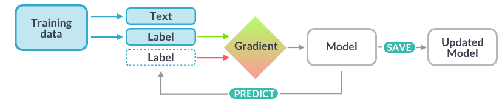
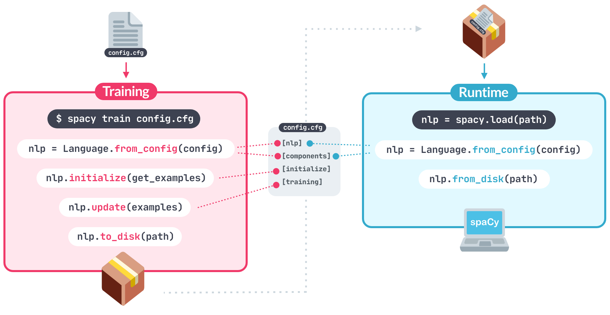

# [Training Pipelines & Models](https://spacy.io/usage/training)

>spaCy’s tagger, parser, text categorizer and many other components are powered by statistical models. ... -> prediction

Essa predição é baseada nos pesos atribuidos no modelo. Por sua vez, tais pesos são estimados a partir de exemplos observados pelo modelo no processzo de treinamento do mesmo.

> Training is an iterative process in which the model’s predictions are compared against the reference annotations in order to estimate the gradient of the loss.

O gradiente de perda é usado para calcular o gradiente de pesos a partir de ["Baclpropagation"](https://thinc.ai/docs/backprop101). Este último gradiente indica como o peso deve mudar para que as prições sejam mais próximas (similares) às etiquetas de referência através do tempo.



> When training a model, we don’t just want it to memorize our examples – we want it to come up with a theory that can be generalized across unseen data. 

Não queremos que o modelo "memorize" que "Amazon" representa sempre uma empresa, mas que "Amazon" em determinados contextos, sim representa a empresa.

> :warining: That’s why the training data should always be representative of the data we want to process.

Além de ter o modelo criado, é necessário pode avaliar a "performance" do modelo, a sua acurácia. Por isso, além dos dados de treinamento, são necessários dados de avaliação (teste)

## Mão na massa: dados de treinamento

O [`spaCy`](https://spacy.io/) possui um comando para processar e executar o fluxo de trabalho de treinamento de uma modelo: [`spacy train`](https://spacy.io/api/cli#train). O mesmo depende de um [`config.cfg`](https://spacy.io/usage/training#config) com toda as informações de configurações/hiperparâmetros, e [os dados de treinamento num formato binário](https://spacy.io/api/data-formats#training).

Contudo, antes de começar a treinar o modelo é necessário definir tais configurações.

### Configurações

Para facilitar a definição de tais arquivos de configurações, existe o [quick start](https://spacy.io/usage/training#quickstart), e também o [init config](https://spacy.io/api/cli#init-config).

`init config`
> Initialize and save a config.cfg file using the recommended settings for your use case. It works just like the quickstart widget, only that it also auto-fills all default values and exports a training-ready config.

:1st_place_medal: `quick start`
> This quickstart widget helps you generate a starter config with the recommended settings for your specific use case. It’s also available in spaCy as the init config command.

O `quick start` demanda que as configurações [pré-definidas](https://spacy.io/usage/training#quickstart) sejam salvar num arquivo [`base_config.cfg`](./base_config.cfg) para então serem usadas no `init config`, com o parâmetro `fill-config`. ao usar o *quick start*, garantiomos que as configurações de treinamento estejam completas e sem *hidden defaults*, garantindo a reproducibilidade do experimento.

```python
python -m spacy init fill-config base_config.cfg config.cfg
```
>✔ Auto-filled config with all values  
✔ Saved config config.cfg  
You can now add your data and train your pipeline:
`python -m spacy train config.cfg --paths.train ./train.spacy --paths.dev ./dev.spacy`

A configuração das `paths` podem estar definidas no `config.cfg`.  

> Some of the main advantages and features of spaCy’s training config are:
> * **Structured sections.** The config is grouped into sections, and nested sections are defined using the '.' notation. For example, [components.ner] defines the settings for the pipeline’s named entity recognizer. The config can be loaded as a Python dict.
> * **References to registered functions.** Sections can refer to registered functions like model architectures, optimizers or schedules and define arguments that are passed into them. You can also register your own functions to define custom architectures or methods, reference them in your config and tweak their parameters.
> * **Interpolation.** If you have hyperparameters or other settings used by multiple components, define them once and reference them as variables.
> * **Reproducibility with no hidden defaults.** The config file is the “single source of truth” and includes all settings.
> * **Automated checks and validation.** When you load a config, spaCy checks if the settings are complete and if all values have the correct types. This lets you catch potential mistakes early. In your custom architectures, you can use Python type hints to tell the config which types of data to expect.

> Under the hood, the config is parsed into a dictionary. It’s divided into sections and subsections, indicated by the square brackets and dot notation. For example, [training] is a section and [training.batch_size] a subsection. Subsections can define values, just like a dictionary, or use the @ syntax to refer to registered functions. This allows the config to not just define static settings, but also construct objects like architectures, schedules, optimizers or any other custom components.

### [Dados de treinamento](https://spacy.io/usage/training#training-data)

Os dados de treinamento do algoritmo pode vir de diferentes formatos. Por isso, o spaCy já disponibiliza um comando ([`spacy convert`](https://spacy.io/api/cli#convert)) para converter tais dados ao formato binário (`.spacy`) requerido pelo sistema. O conversor pode ser definido na linha de comando ou [escolhido dentre as opções predefinidas](https://spacy.io/api/cli#converters) a partir da extensão do arquivo de entrada.

O processo de conversão dos dados de treinamento está centrado na criação de um objeto [`Doc`](https://spacy.io/api/doc). 

> For example, if you’re creating an NER pipeline, loading your annotations and setting them as the .ents property on a Doc is all you need to worry about.

## [Customização de pipeline e treinamento](https://spacy.io/usage/training#config-custom)

Tipicamente estamos treinando um *pipeline* de um ou mais componentes. O bloco ["[components]"](./config.cfg#21), no `config.cfg`, define os componentes disponíveis e como devem ser criados: a partir de um [`factory`](https://spacy.io/usage/processing-pipelines#built-in) ou a aprtir de uma [fonte já existente](https://spacy.io/usage/processing-pipelines#sourced-components).

Por exemplo: "[components.parser]" está definindo um componente "parser" na pipeline.

Os cenários mais comuns em como tratar os componentes são:
1. Treinar um novo componente do início com seus dados.
2. Atualizar um componente existente já treinado com mais exemplos.
3. Incluir um componente já treinado sem atualizá-lo.
4. Incluir um componente não treinável, como um [`EntityRuler`](https://spacy.io/api/entityruler) baseado em regras ou um [`Sentencizer`](https://spacy.io/api/sentencizer), ou um componente completamente customizado.  

Ao usar um componente já existente, a fonte será informada no `[components]`, em um a `source`, a qual será copiada com seus valores de peso. Dessa formar, se inclui um componente já treinado no *pipeline*, ou a atualização do mesmo com dados mais específicos.
 
**Exemplo config.cfg**:
```yaml
[components]

# "parser" and "ner" are sourced from a trained pipeline
[components.parser]
source = "en_core_web_sm"

[components.ner]
source = "en_core_web_sm"

# "textcat" and "custom" are created blank from a built-in / custom factory
[components.textcat]
factory = "textcat"

[components.custom]
factory = "your_custom_factory"
your_custom_setting = true
```

Componente que sejam treináveis serão inicializados com valores de peso aleatórios. Para componentes já existentes, spaCy irá manter os pesos exstentes.

Caso um componente já existente não deva ser atualizado, deve-se adicioná-lo em `frozen_components` no bloco "[training]". Os componentes congelados não são atualizados pelo treinamento e são incluidos no *pipeline* final "as-is". Estes serão, também, excluidos da chamada `nlp.initialize`.

## [annotating-components](https://spacy.io/usage/training#annotating-components)

Por padrão, componentes são atualizados de forma isolada. Isso quer dizer que eles não recebem as predições feitas pelos componentes anteriores, do pipeline. Um componente recebe um `Example.predicted` como entrada e compara suas predições como as do `Exemple`, sem salvar as `annotations` no `doc`.

Caso seja necessário acessar as `annotations`, deve-se adicionar `annotating_components` no `trainning` block. Qualquer componente pode ser incluído como `annotating component`, inclusive components congelados.

## [Arquitetura de modelo](https://spacy.io/usage/training#model-architectures)

A arquitetura de modelo é uma função que encadeia uma instância `Thinc Model`, a qual pode-se usar em um componente ou uma camada de uma rede maior. Pode-se usar `Thinc` como um pequeno empacotadorde outras frameworks, como PyTorch, TensorFlow or MXNet, ou uma lógica em especial.

Os componentes spaCy nunca instanciarão os modelos, portanto, não é necessário criar subclasses para mudar a arquitetura do modelo. Pode-se atualizar o `config.cfg` de forma a relacionar a diferentes funções. 

Uma vez criado o componente, a intância do modelo já foi assignada e por isso não poderá ter sua arquitetura alterada. A arquitetura é como uma receita: uma vez preparado o prato, não se pode alterar a receita.

spaCy inclui várias arquiteturas prontas para diferentes tarefas:

* [HashEmbedCNN](https://spacy.io/api/architectures#HashEmbedCNN)  
* [TransitionBasedParser](https://spacy.io/api/architectures#TransitionBasedParser)
* [TextCatEnsemble](https://spacy.io/api/architectures#TextCatEnsemble)

## [Métricas, treinamento e pontuação de pesos](ttps://spacy.io/usage/training#metrics)

Ao treinar um *pipeline* uma tabela será apresentada com a métricas alcançadas. As métricas disponíveis dependen do `components`. Pode-se configurar qual pontuação será apresentada e tamvbém como elas serão usadas na ponderação da pontuação final que irá definir o melhor modelo. Essa customização deverá ser feita no bloco `training.score_weights` do `config.cfg`.

No exemplo a seguir, a the labeled dependency accuracy and NER F-score count towards the final score with 40% each and the tagging accuracy makes up the remaining 20%. The tokenization accuracy and speed are both shown in the table, but not counted towards the score.

| NAME | DESCRIPTION |
|---|---|
| Loss | The training loss representing the amount of work left for the optimizer. Should decrease, but usually not to 0. |
| Precision (P) | Percentage of predicted annotations that were correct. Should increase. |
| Recall (R) | Percentage of reference annotations recovered. Should increase. |
| F-Score (F) | Harmonic mean of precision and recall. Should increase. |
| UAS / LAS | Unlabeled and labeled attachment score for the dependency parser, i.e. the percentage of correct arcs. Should increase. |
| Speed | Prediction speed in words per second (WPS). Should stay stable. |
:warning: Note that if the development data has raw text, some of the gold-standard entities might not align to the predicted tokenization. These tokenization errors are excluded from the NER evaluation. If your tokenization makes it impossible for the model to predict 50% of your entities, your NER F-score might still look good.

# Inicialização

Ao iniciar o treinamento de um modelo novo, spaCy inicializará  *pipeline* e carregará os dados necessários com o `nlp.initialize`. Toda configuração deste proceso estará no bloco "[initialize]". O prcoesso de incialização tipicamente inclui:

1. Carrega osdados definidos em "[initialize]", incluindo *word vectors* e pesos e tok2vec pré treinados.
2. Chama a inicialização de tokenização e *pipeline* component com *callback* para acessar os dados de treinamento, o objeto `nlp` e qualquer outro argumento definido no bloco "[initialize]".
3. No *pipeline components*: se necessário, usa os dados para inferir formatos faltantes and configura esquema de *label* caso não fornecido. Components podem, ainda, carregar outros dados como tableas e dicionários.


